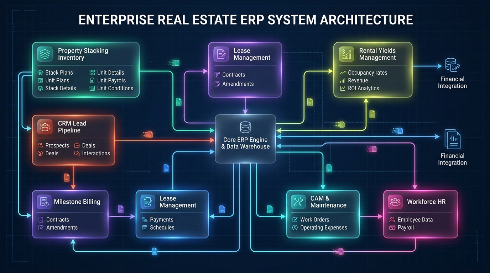
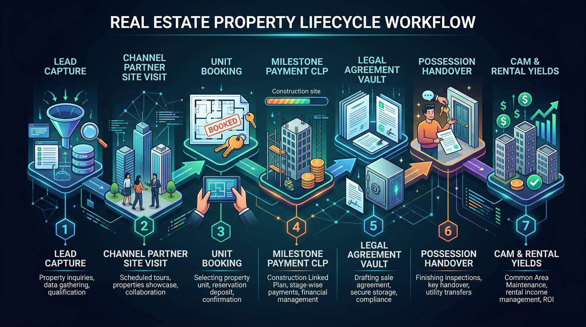
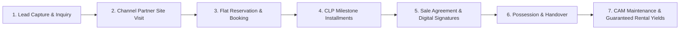
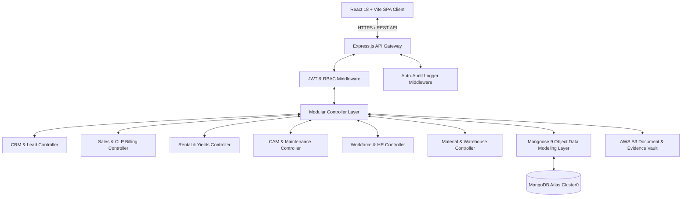
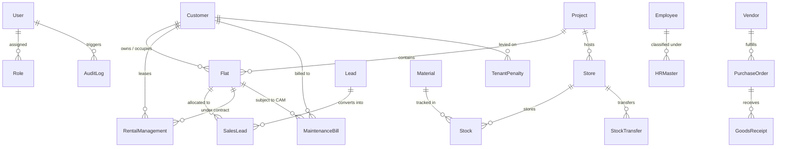

# 🏢 Krishna Valley Real Estate ERP System
### Enterprise Real Estate, Stacking Inventory, CLP Milestone Billing, Rental Yields & Workforce Management Platform



[](https://nodejs.org/)
[](https://www.mongodb.com/cloud/atlas)
[](https://vitejs.dev/)
[](https://vercel.com)
[](https://krishnavalley-backend.onrender.com/api/health)
[](#license)

---

## 📖 Table of Contents
1. [Executive Overview](#-executive-overview)
2. [End-to-End Property Lifecycle Workflow](#-end-to-end-property-lifecycle-workflow)
3. [System Architecture & Data Flow](#-system-architecture--data-flow)
4. [Complete Database Schema & ERD](#-complete-database-schema--erd)
5. [Database Schema Dictionary (All 28 Collections)](#-database-schema-dictionary-all-28-collections)
6. [Strict Datatype Validation & Sanitization Engine](#-strict-datatype-validation--sanitization-engine)
7. [Ghost Box & Default Value Elimination](#-ghost-box--default-value-elimination)
8. [Core Modules & Features](#-core-modules--features)
9. [Automated System Health & Verification Suite](#-automated-system-health--verification-suite)
10. [Cloud Deployment & Production Setup](#-cloud-deployment--production-setup)
11. [Default Credentials & Access Control](#-default-credentials--access-control)

---

## 🌟 Executive Overview

**Krishna Valley ERP** is an enterprise-grade property management and construction management platform built specifically for real estate developers, township builders, channel partner networks, and property managers. It unifies the entire real estate operational spectrum into a centralized, real-time command center.

### Key Capabilities:
- **Visual Stacking Inventory Matrix**: Live floor-by-floor unit stacking matrix with BHK configurations, carpet/super-built-up area, PLC (Preferential Location Charges), and real-time statuses (*Available, Booked, On Hold, Blocked*).
- **CRM & Channel Partner Engine**: Lead acquisition pipeline, automated visit logging with geo-tagged selfies, and tiered commission ledgers for brokers and channel partners.
- **CLP Milestone Billing Engine**: Construction-Linked Payment plans, automated demand letter generation, interest calculations, and bank milestone reconciliation.
- **Guaranteed Yields & Dual-Lease Rental**: Corporate bundle leasing, rent-back yields for property owners, and security deposit management.
- **Common Area Maintenance (CAM) & Services**: Automated square-footage maintenance billing, resident service ticketing with SLA tracking, and tenant infraction penalty tracking.
- **Workforce & Site HR**: Employee directory, daily biometric/clock-in attendance, shift management, role masters, and monthly payroll slips.
- **Warehouse & Material Logistics**: Multi-warehouse stock ledger, purchase orders (POs), Goods Receipts (GRN), site transfers, and gatepass tracking.
- **Security & Compliance Audit Vault**: Automatic tamper-evident audit logging on every API route, digital signature workflows, and S3 legal document vault.

---

## 🔄 End-to-End Property Lifecycle Workflow

The following illustration maps the complete business lifecycle from initial prospect capture to construction-linked payment, possession, common area maintenance, and guaranteed rental yields:



### Business Workflow Steps:



1. **Lead Capture & Qualification**: Prospects enter via digital portals, walk-ins, or channel partners into the CRM funnel.
2. **Channel Partner Site Visit**: Agents log verified client site visits with property inspections, geo-tagged photos, and visit notes for verification.
3. **Unit Selection & Reservation**: The buyer selects an available unit from the interactive Stacking Matrix and deposits booking earnest money.
4. **CLP Milestone Invoicing**: Construction milestones trigger automated demand notices, receipts, and payment schedules.
5. **Agreement & Document Vault**: Sale deed drafting, buyer KYC (12-digit Aadhaar, PAN verification), and digital signature execution.
6. **Possession & Handover**: Snag-list resolution, final balance clearance, and handover certificate issuance.
7. **CAM & Yield Operations**: The unit transitions to either Owner Living (CAM maintenance billing) or Guaranteed Rent-Back (company manages rental lease and monthly payout to owner).

---

## 🏛️ System Architecture & Data Flow



---

## 🗄️ Complete Database Schema & ERD

The system is powered by **28 specialized Mongoose collections** organized into high-cohesion functional clusters:



---

## 📚 Database Schema Dictionary (All 28 Collections)

### 1. Core Authentication & Governance
| Collection | Model Name | Primary Fields | Relations / Purpose |
| :--- | :--- | :--- | :--- |
| `users` | `User` | `username`, `email`, `passwordHash`, `roleId`, `status`, `agentProfile` | System users, Admins, Agents, Staff |
| `roles` | `Role` | `roleName`, `roleCode`, `permissions`, `isSystemRole` | Role-Based Access Control definitions |
| `permissions`| `Permission` | `permissionName`, `permissionCode`, `module`, `action` | Granular permission registry (42 permissions) |
| `branches` | `Branch` | `branchName`, `branchCode`, `address`, `contactNumber` | Multi-branch organizational structure |
| `auditlogs` | `AuditLog` | `userId`, `action`, `module`, `endpoint`, `ipAddress`, `statusCode` | Tamper-evident operational audit trail |

### 2. Property & Project Assets
| Collection | Model Name | Primary Fields | Relations / Purpose |
| :--- | :--- | :--- | :--- |
| `projects` | `Project` | `projectName`, `projectCode`, `location`, `totalTowers`, `status` | Master township & building development project |
| `flats` | `Flat` | `flatNumber`, `floor`, `bhkType`, `superArea`, `basePrice`, `status` | Individual property units in stacking matrix |

### 3. CRM & Channel Partner Network
| Collection | Model Name | Primary Fields | Relations / Purpose |
| :--- | :--- | :--- | :--- |
| `leads` | `Lead` | `name`, `mobileNo`, `email`, `status`, `assignedAgentId`, `budget` | Top-of-funnel prospective inquiries |
| `salesleads` | `SalesLead` | `leadId`, `customerId`, `flatId`, `paymentPlan`, `totalCost`, `stage` | Converted sales deals & CLP milestone bookings |
| `sitevisits` | `SiteVisit` | `agentCode`, `partyName`, `partyMobile`, `visitDate`, `status`, `partySelfie` | Verified site visits with customer photo proof |
| `commissionledgers` | `CommissionLedger`| `agentId`, `dealId`, `grossCommission`, `tdsAmount`, `payoutStatus` | Broker & channel partner payouts |

### 4. Customer & Rental Yield Management
| Collection | Model Name | Primary Fields | Relations / Purpose |
| :--- | :--- | :--- | :--- |
| `customers` | `Customer` | `customerType`, `name`, `mobileNo`, `alternateMobileNo`, `ownerDetails`, `tenantDetails` | Centralized customer directory (Owners & Tenants) |
| `rentalmanagements` | `RentalManagement` | `flatId`, `ownerId`, `tenantId`, `rentBack`, `tenantAgreement`, `securityDeposit` | Dual-sided lease contracts (Rent-Back + Tenant) |

### 5. Maintenance & Facilities (CAM)
| Collection | Model Name | Primary Fields | Relations / Purpose |
| :--- | :--- | :--- | :--- |
| `maintenancebills` | `MaintenanceBill` | `billNumber`, `flatId`, `customerId`, `camCharges`, `totalAmount`, `status` | Monthly Common Area Maintenance dues |
| `servicerequests` | `ServiceRequest` | `ticketNumber`, `flatId`, `category`, `priority`, `status`, `assignedTo` | Resident complaints & facility work orders |
| `tenantpenalties` | `TenantPenalty` | `penaltyNumber`, `flatId`, `customerId`, `violationType`, `description`, `penaltyAmount` | Rule infraction penalties & fines |

### 6. Materials, Stores & Logistics
| Collection | Model Name | Primary Fields | Relations / Purpose |
| :--- | :--- | :--- | :--- |
| `stores` | `Store` | `storeName`, `storeCode`, `projectId`, `storeKeeperId`, `location` | Physical on-site warehouses & inventory depots |
| `materials` | `Material` | `materialName`, `itemCode`, `category`, `unitOfMeasure`, `unitPrice` | Material inventory master catalog |
| `stocks` | `Stock` | `storeId`, `materialId`, `currentStock`, `reorderLevel` | Real-time bin & warehouse stock counts |
| `stocktransfers`| `StockTransfer` | `transferNumber`, `fromStoreId`, `toStoreId`, `materialId`, `quantity`, `gatepassNumber` | Inter-site transfers with gatepass numbers |
| `vendors` | `Vendor` | `vendorName`, `vendorCode`, `contactPerson`, `gstNumber`, `panNumber` | Material suppliers & contractor directory |
| `purchaseorders`| `PurchaseOrder` | `poNumber`, `vendorId`, `items`, `subTotal`, `taxAmount`, `totalAmount`, `status` | Formal procurement purchase orders |
| `goodsreceipts` | `GoodsReceipt` | `grnNumber`, `poId`, `receivedItems`, `challanNumber`, `inspectionStatus` | Verified warehouse goods delivery slips |
| `materialissues`| `MaterialIssue` | `issueNumber`, `storeId`, `flatId`, `issuedItems`, `contractorName` | Site issuance of cement, steel, tiles, etc. |

### 7. Workforce & Human Resources (HR)
| Collection | Model Name | Primary Fields | Relations / Purpose |
| :--- | :--- | :--- | :--- |
| `employees` | `Employee` | `employeeCode`, `firstName`, `lastName`, `departmentId`, `roleId`, `mobileNo`, `basicSalary` | Complete staff & site workforce directory |
| `hrmasters` | `HRMaster` | `departments`, `roles`, `leaveTypes`, `companyPolicy` | Departmental organizational hierarchy |

### 8. Legal Documents, Signatures & Communications
| Collection | Model Name | Primary Fields | Relations / Purpose |
| :--- | :--- | :--- | :--- |
| `legaldocuments`| `LegalDocument` | `documentTitle`, `category`, `fileUrl`, `uploadedBy`, `expiryDate` | Legal deeds, title approvals, and blueprints |
| `digitalsignatures` | `DigitalSignature` | `documentId`, `signatoryName`, `signatoryEmail`, `signatureHash`, `signedAt` | Legally binding e-signatures |
| `remindertemplates` | `ReminderTemplate`| `templateCode`, `channel`, `subject`, `bodyText`, `variables` | Multi-channel communication templates |
| `notificationconfigs` | `NotificationConfig` | `smtpConfig`, `whatsappCloudConfig`, `smsConfig`, `pushConfig` | Centralized gateway credentials |
| `notificationlogs` | `NotificationLog` | `recipient`, `channel`, `templateCode`, `status`, `dispatchedAt` | Audit log of dispatched alerts |
| `systemsettings` | `SystemSettings` | `company`, `financialYear`, `taxSlabs`, `paymentGateway`, `smtp`, `whatsapp` | Global ERP operational configuration |

---

## 🛡️ Strict Datatype Validation & Sanitization Engine

To maintain institutional-grade database integrity, strict datatype enforcement is applied at both the **React input layer** (physical keystroke sanitization) and the **Mongoose controller layer**:

```
[User Keystroke / Paste] ──> [Frontend Sanitizer] ──> [React State] ──> [API Payload] ──> [Backend Controller] ──> [MongoDB Atlas]
                                     │                                                            │
                            Blocks invalid chars                                         Validates format/length
```

| Field Category | Enforced Datatype | Allowed Characters | Auto-Blocked Characters |
| :--- | :--- | :--- | :--- |
| **Names & People**<br>*(Full Name, Father Name, Contact Person)* | **Alphabets Only** | `A-Z`, `a-z`, spaces, `.`, `-` | Digits (`0-9`) and special characters are blocked immediately. |
| **Locations**<br>*(City, State, Country)* | **Alphabets Only** | Letters and spaces only | Numbers are physically blocked from being typed. |
| **Mobile & Phone Numbers** | **Phone Digits Only** | Digits `0-9`, optional leading `+` | Alphabets and symbols are blocked; validated for 7-13 digits. |
| **Primary vs Alternate Mobile** | **Strictly Distinct** | Distinct phone numbers | The system rejects records where Primary and Alternate phones match. |
| **Pincode** | **6 Digits Only** | Digits `0-9` (Max 6) | Alphabets and lengths $\neq 6$ are blocked. |
| **Govt ID: Aadhaar Card** | **12 Digits Only** | Digits `0-9` (Max 12) | **Letters (`bnb`, etc.) are completely blocked.** |
| **Govt ID: PAN Card** | **10-Char PAN Format** | Standard `ABCDE1234F` format | Auto-capitalized; invalid formats rejected. |
| **Financial Amounts**<br>*(Rent, Deposit, Fine, Salary)* | **Numbers Only** | Digits `0-9` | Alphabets blocked on keystroke. |

---

## 🚫 Ghost Box & Default Value Elimination

All arbitrary dummy defaults have been eliminated across the entire user interface:
- **`120+` Badge Removed**: The hardcoded ghost counter next to `Agent Network` in the sidebar has been removed.
- **Customer Modal Cleaned**: Removed hardcoded `'Jaipur'`, `'Rajasthan'`, `'302001'`, `25000`, and `50000`. Inputs start blank and dynamically pull the real expected rent from the database when a flat is chosen.
- **Rental Agreements Cleaned**: Hardcoded dummy numbers (`20000`, `28000`, `40000`, `56000`) replaced with real database pricing from the selected unit.
- **HR Onboarding Cleaned**: Removed default salary (`45000`), default city, and dummy fallback phone (`+91 98765 00000`).
- **Infraction Penalties Fixed**: Resolved empty `PENALTY CODE` and `INFRACTION REASON` columns by binding to `penaltyNumber` and `description` with violation type badges.

---

## ⚡ Automated System Health & Verification Suite

The repository includes automated diagnostic scripts to verify database integrity, syntax, and API health:

### 1. Database Schema & Index Synchronization
```bash
node backend/scripts/syncSchemas.js
```
*Connects to MongoDB Atlas, verifies all 28 Mongoose models, builds collection indexes, and standardizes existing documents.*

### 2. Full-Stack Syntax & Compile Check
```bash
node backend/scripts/checkSyntax.js
```
*Recursively compiles all 94 backend JavaScript files using Node.js AST validation.*

### 3. Comprehensive Authenticated API Health Suite
```bash
node backend/scripts/testAllModules.js
```
*Authenticates via Super Admin JWT and verifies all 23 endpoints across all sidebar modules (100% Pass rate).*

---

## 🚀 Cloud Deployment & Production Setup

### Live Production Endpoints:
- **Frontend App**: [https://krishnavalley-erp.vercel.app](https://krishnavalley-erp.vercel.app)
- **Backend API**: [https://krishnavalley-backend.onrender.com](https://krishnavalley-backend.onrender.com)
- **Health Check**: [https://krishnavalley-backend.onrender.com/api/health](https://krishnavalley-backend.onrender.com/api/health)

### Local Development:

#### 1. Clone & Install
```bash
git clone https://github.com/SanskarAgrawal-009/krishnavalleyERP.git
cd krishnavalleyERP
```

#### 2. Backend Setup
```bash
cd backend
npm install
npm run dev
```
*Runs on `http://localhost:5000`*

#### 3. Frontend Setup
```bash
cd ../frontend
npm install
npm run dev
```
*Runs on `http://localhost:5173`*

---

## 🔑 Default Credentials & Access Control

| Role | Email / Identifier | Password | Access Scope |
| :--- | :--- | :--- | :--- |
| **Super Administrator** | `admin@krishnavalley.com` | `Admin@12345` | Complete system-wide administrative access |
| **Sales Manager** | `sales@krishnavalley.com` | `Sales@12345` | CRM, Leads, Stacking Matrix & Bookings |
| **Accounts / Billing** | `accounts@krishnavalley.com` | `Accounts@12345` | CLP Milestone Invoicing & CAM Dues |
| **Channel Partner** | `agent@krishnavalley.com` | `Agent@12345` | Agent Portal, Lead Pipeline & Site Visits |

---

## 📄 License
Enterprise Proprietary Software. All rights reserved by Krishna Valley Developers & Technology Operations.
