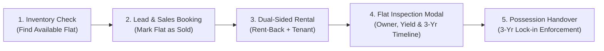

# End-to-End Manual Testing Guide: Flat Sales to Rental Lifecycle

This guide covers complete manual test scenarios for verifying the entire business workflow:
**Lead Capture ➔ Flat Booking & Sale ➔ 3-Year Guaranteed Rental Enrollment ➔ Inventory Flat Inspection ➔ Possession Handover Lock-in Validation**.

---

## 🔑 Test Credentials Reference

| Role | Username / Email | Password | Primary Scope |
| :--- | :--- | :--- | :--- |
| **Super Admin** | `admin` | `Admin@12345` | Unrestricted full master access |
| **Rental Manager** | `rental_manager` | `Rental@12345` | Rental contracts, rent-back yields, tenant leases, inspections |
| **Sales Head** | `sales_head` | `Sales@12345` | Deals, booking advances, agreements, possession scheduling |

---

## 🗺️ High-Level Test Journey Overview

---

## 🧪 Test Scenarios Matrix

### Scenario 1: Pre-requisite Flat Verification (Available State)
**Objective**: Verify that an unsold flat displays as available with no owner or active lease, and shows the 3-Year rental notice for future buyers.

* **Steps**:
  1. Login as `rental_manager` or `admin` at `http://localhost:5173/login`.
  2. Navigate to **Sites & Property Inventory** (`/inventory`).
  3. Select **Krishna Valley Township** (or any active project) and select a tower (e.g. *Tower A*).
  4. Find any flat with status `AVAILABLE` (e.g., *Flat 103* or *Flat A237*).
  5. Click directly on the flat card.
* **Expected Results**:
  - The **Flat Detail Modal** opens instantly without lagging.
  - Header shows badge `AVAILABLE` in green.
  - **Sale Status Tab**: Displays *"This Flat is Currently Available for Sale"* with base price.
  - **Rental Tab**: Indicates no active lease is attached yet.
  - **Possession Timeline Tab**: Shows `AVAILABLE FOR SALE` with notice: *"Upon purchase & enrollment, a 3-year guaranteed rental lock-in will apply prior to physical possession."*

---

### Scenario 2: Lead Conversion & Flat Sale Booking
**Objective**: Book an available flat to a customer, confirm payment, and record sale agreement.

* **Steps**:
  1. Navigate to **Sales & Allotments** (`/sales`).
  2. Click **"+ New Booking / Convert Lead"** (or convert an inquiry from `/crm`).
  3. Fill in the buyer details:
     - **Buyer Name**: `Aditya Pratap Singh`
     - **Mobile Number**: `9810112233`
     - **Email**: `aditya.singh@gmail.com`
     - **Select Flat**: Choose the available flat from Scenario 1.
     - **Agreed Deal Price**: `₹45,00,000`
     - **Booking Token Amount**: `₹1,00,000`
     - **Payment Plan**: `Construction Linked (CLP)`
  4. Click **Submit Booking**.
  5. Open the newly created deal in the **Sales Register**, go to the **Booking Tab**, and set status to **Confirmed**.
  6. In the **Agreement (BBA) Tab**, check **"Signed & Uploaded"**.
* **Expected Results**:
  - Deal status changes to `Booked` / `Agreement Completed`.
  - In MongoDB and the UI, the Flat status updates from `available` to `sold`.
  - Customer `Aditya Pratap Singh` is auto-registered as an `Owner` in the Customer Registry (`/customers`).

---

### Scenario 3: Enrolling Flat into the 3-Year Guaranteed Rental Program
**Objective**: Create a dual-sided rental contract taking the flat from the owner under rent-back and assigning a tenant.

* **Steps**:
  1. Navigate to **Rental & Rent-Back** (`/rentals`).
  2. Click **"+ New Rental Contract"**.
  3. Select the Project, Building, and the flat booked in Scenario 2.
  4. Notice the **Auto-Owner Detection**: The system should automatically populate `Aditya Pratap Singh` as the flat owner.
  5. **Side A: Owner Rent-Back Configuration**:
     - Toggle **"Enable Rent-Back (Company takes flat from owner)"** to **ON**.
     - Notice the **Start Date**: Defaults to Today (`2026-08-31`).
     - Notice the **End Date**: Automatically calculates **3 Years (36 Months)** ahead (`2029-08-31`).
     - Enter **Guaranteed Monthly Rent to Owner**: `₹25,000`.
     - Enter **Rent Due Day**: `5th of every month`.
     - Enter **Owner Security Deposit**: `₹50,000`.
  6. **Side B: Tenant Agreement Configuration**:
     - Select an existing tenant or enter a new tenant name (e.g. `Kavita Sharma`, `9876543299`).
     - Notice the **Tenant Agreement End Date**: Defaults to **3 Years**.
     - Enter **Monthly Rent Collected from Tenant**: `₹28,000`.
     - Enter **Tenant Security Deposit**: `₹56,000`.
     - Allocation Status: `Occupied`.
  7. Click **"Generate Rental Contract"**.
* **Expected Results**:
  - Contract is created with two sides: Owner Yield (`₹25,000/mo`) and Tenant Lease (`₹28,000/mo`).
  - Net positive spread of `₹3,000/mo` for the developer/management company.
  - Flat status in Property Inventory updates to reflect **"3-Yr Rental Program"**.

---

### Scenario 4: Detailed Flat Card Inspection in Property Inventory
**Objective**: Verify that clicking the flat card in Inventory displays full owner dossier, rental yields, and the 3-year timeline.

* **Steps**:
  1. Go to **Sites & Property Inventory** (`/inventory`).
  2. Hover over the sold flat card. Notice the hover elevation and `"Click to inspect ➔"` prompt.
  3. Click anywhere on the flat card.
* **Expected Results**:
  - **Top Banner**: Prominently displays:
    > `🔒 3-Year Rental Policy: Locked for 3 Years (Possession Available in 36 Months / 1095 Days)`
  - **Progress Bar**: Shows **0% to 1% elapsed** of the mandatory 36-month term.
  - **Tab 1 (Unit Specs)**: Correct tower, floor, BHK, carpet area, base price, and status `SOLD`.
  - **Tab 2 (Owner & Purchase Dossier)**:
    - Displays `Aditya Pratap Singh`, phone `9810112233`, email, and ownership type `Individual (100%)`.
    - Shows Deal Value `₹45,00,000` and Booking Advance `₹1,00,000`.
  - **Tab 3 (Rental & Leases - 3-Yr)**:
    - **Side A**: Guaranteed Owner Rent `₹25,000/mo`, due day 5th, 3-year lease span.
    - **Side B**: Tenant `Kavita Sharma`, rent `₹28,000/mo`, occupancy `Occupied`.
  - **Tab 4 (Possession Timeline)**:
    - Badge: `🔒 POSSESSION LOCKED`.
    - Exact 3-Year eligibility date (3 years from lease start date).
    - Readiness status: `NOT READY (LOCKED)`.

---

### Scenario 5: Enforcing the 3-Year Possession Handover Lock-in Rule
**Objective**: Verify that the system blocks early possession handover before the 3-year rental term expires.

#### Test 5A: Premature Handover Attempt (Should be BLOCKED)
* **Steps**:
  1. Navigate to **Sales & Allotments** (`/sales`).
  2. Open the deal for `Aditya Pratap Singh`.
  3. Switch to **Tab 6: Possession & Handover**.
  4. Notice the warning banner:
     > `🔒 3-Year Mandatory Rental Program Policy: All units under Krishna Valley's guaranteed rental program are subject to a mandatory 36-month lease term before possession is granted.`
  5. Set **Possession Readiness Status** to **"Possession Completed"**.
  6. Leave the *"Authorize Early Possession Override"* checkbox **UNCHECKED**.
  7. Click **"Save Possession Status"**.
* **Expected Results**:
  - The API rejects the update with `HTTP 400 Bad Request`.
  - Toast/Alert displays:
    > `"Possession cannot be handed over. Flat is locked under the mandatory 3-Year Rental Program until [Date] (36 months remaining)."`
  - Possession is **not** marked completed.

#### Test 5B: Administrative Override Handover (Authorized Bypass)
* **Steps**:
  1. Check the box: `[✓] Authorize Early Possession / Administrative Lock-in Override`.
  2. Add remarks: `"Special Board Approval #KV-2026-90: Early handover granted under client relocation clause."`
  3. Click **"Save Possession Status"**.
* **Expected Results**:
  - The request succeeds.
  - Sales status transitions to `Possessed`.
  - In the Flat Detail Modal, the status updates to:
    > `✓ POSSESSION COMPLETED: Possession has already been completed on [Today's Date].`

---

### Scenario 6: Role-Based Access Validation for Rental Manager
**Objective**: Verify that the `rental_manager` user can access rental operations and flat details, but cannot alter restricted modules (e.g. HR payroll, site engineer stores).

* **Steps**:
  1. Logout from current session.
  2. Login with:
     - Username: `rental_manager`
     - Password: `Rental@12345`
  3. Verify sidebar navigation:
     - **Allowed**: Dashboard, Inventory, Rentals, Customers, Maintenance, Documents, Reports.
     - **Hidden / Restricted**: HR Workforce management, Access Control user role editing.
  4. Navigate to `/inventory` and inspect any flat card.
  5. Navigate to `/rentals` and verify ability to manage yields, record collections, and trigger tenant messages.
* **Expected Results**:
  - Seamless login and tailored dashboard for rental operations.
  - Full permissions to manage dual-sided rentals and view 3-year possession timelines.

---

## 📋 Quick Test Checklist

| # | Test Checkpoint | Expected Status |
| :-: | :--- | :---: |
| 1 | Click on any flat card in Inventory opens `FlatDetailModal` | ✅ Pass |
| 2 | Unsold flat displays as `AVAILABLE` with no owner | ✅ Pass |
| 3 | Sold flat displays full owner name, contact, PAN/Aadhaar & booking terms | ✅ Pass |
| 4 | Manual Rental Modal defaults end dates to exactly 3 Years (36 Months) | ✅ Pass |
| 5 | Enrolled flat displays Side A (Rent-back yield) and Side B (Tenant lease) | ✅ Pass |
| 6 | Visual timeline displays 36-month progress bar with days remaining | ✅ Pass |
| 7 | Attempting possession before 3 years without override is blocked with 400 error | ✅ Pass |
| 8 | Administrative override checkbox allows early handover with recorded audit remarks | ✅ Pass |
| 9 | `rental_manager` user logs in with `Rental@12345` and has appropriate operational rights | ✅ Pass |
